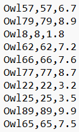

# 1933 Lab 4: IDEs and File I/O

## Using an IDE

If you are comfortable using Java in an IDE like IntelliJ or VSCode, you can skip this section, but it is recommended to ensure you are following the best practices.

You've already received your first project in class. When creating larger code bases, it can be tedious to switch back and forth from a text editor to the terminal, and all the code files. This is where an Integrated Development Environment (IDE) like IntelliJ comes in handy.

We recommend using IntelliJ IDEA by Jetbrains for his class, and for later projects and labs, this will be the required IDE. IntelliJ is an industry-standard IDE that also has a free community version. Instructions for downloading IntelliJ Community Edition can be found [HERE](https://www.jetbrains.com/help/idea/installation-guide.html#standalone). Make sure to scroll down to the ”Standalone Installation” section to download just IntelliJ.

Now that IntelliJ is downloaded and you have your license registered, you can create a new project from scratch. IntelliJ will find your Java SDK and ask if you want any external libraries. For this lab, we will use native Java, so just click next. Rename the project to lab4 and change the project location to your labs/lab4 directory.

Paste the provided .java files into the new lab4/src/ folder, and the .csv files into lab4/. For any IntelliJ project you create, all code should be located in the src folder; this is where the IDE "looks for” code to be compiled and run. Any external files will be located in the parent directory.

Now you have all your files in place, but IntelliJ still needs to know which main to run. In the top right corner, there is a button to add a new configuration. Select that then select the Application option, and your main class will be Owl for Milestone 1 then OwlPopulation for the rest. You may add multiple configurations and switch between them on the fly using this button as well. Alternatively, you can go to the Run menu and select Run... to pull up a menu that will create a configuration for your currently open file, as long as it has `public static void main(String[] args)`.

Now that IntelliJ knows where your main is, hitting the green hammer and green play button will build and run your project respectively.

**TIP**: Sometimes when starting a project via opening a folder with IntelliJ or other import methods, the sources module will not be properly defined for the project. Naming the folder containing your code ”src” lets IntelliJ identify the folder as containing source code. If the sources of the project are not defined, IntelliJ doesn’t know what files it will need to compile to run the configuration you set up earlier. To fix this, go to File — Project Structure. Then, navigate to the Modules tab of Project Settings. Select the folder containing your .java files and click Mark as Sources, then apply. You can tell that sources are properly recognized if the symbol next to the file in the IntelliJ file explorer is a blue C (with a green arrow if it has a main method).

Let's begin!


```bash
git pull
```
*Note: In the terminal, navigate to the top of the `CSCI-1933-Student-Code` directory using the `cd` command.*

## Milestone 1

Now that you have an IDE set up, this lab will cover some basic file I/O, and processing/analyzing large datasets. You'll be working with some populations of owls!

### Owl Class

Let's begin by making an Owl class in the Owl.java file.

1. Each Owl has its own *name*, *age*, and *weight*, so we need instance variables to reflect this; They would have types *String*, *int*, and *double* respectively. It is good practice to make these *private*.

2. Make a constructor for your Owl class that initializes the instance variables using the arguments passed in.

```Java
public Owl(String name, int age, double weight)
```

3. Since your instance variables are *private*, you should make these getters and setters for them:

- `public String getName()`
- `public void setName(String name)`
- `public int getAge()`
- `public void setAge(int age)`
- `public double getWeight()`
- `public void setWeight(double weight)`

4. Create an `equals()` method that returns `true` if the name, age, and weight of the Owl are equal to the other Owl's name, age, and weight; Otherwise, it should return `false`. (Remember to use `.equals()` when comparing Strings and Objects, and use `==` to compare primitive types like doubles and integers).

```Java
public boolean equals(Owl other)
```

5. Create a main method in your Owl class. Make a few instantiations of your Owl class, and demonstrate that your equals method works. If your main method contains this code:

```Java
Owl owl1 = new Owl("owl1", 5, 12.0);
Owl owl2 = new Owl("owl2", 5, 12.0);
Owl owl3 = new Owl("owl1", 5, 12.0);
System.out.println(owl1.equals(owl2));
System.out.println(owl1.equals(owl3));
```

Your output should be false, and true.

### Milestone 1 Checkoff

> Show a TA your Owl class, and run your main method.

## Milestone 2

### OwlPopulation Class

Now we're going to be making a class that models a population of Owls. So far in class, you've seen arrays with primitive types, like an integer array, int[]. However, Java arrays are capable of storing any type, including Object types defined in classes.

With an owl population, we can represent this as an array of Owl objects. The type of the array would be **Owl[]**. There should be an **Owl** object stored at each index of this array. You can access these Owl instances using array notation like you have previously. Suppose you have this code:

```Java
Owl[] owlPopulation = new Owl[1];
Owl owl1 = new Owl("owl1", 5, 12.0);
owlPopulation[0] = owl1;
```

If you want to access an attribute or method of that owl, you can also do that like this:

```Java
owlPopulation[0].setAge(6);
```

- Create a constructor for OwlPopulation that takes in a file name as an argument. Initialize **fileName** and call **populateData()**. This method will initialize **data[]** and populate it will Owl objects.

### Taking File Input

Now, you'll be working with comma-separated-value (CSV) files. Open the file with a simple text editor (not Excel), you'll see something like this:



If you open up the OwlPopulation.java file, you'll see some strange lines like "throws FileNotFoundException", "try", and "catch". You don't need to worry about these, however, you need to include these when trying to open a file. We will revisit exceptions at a later time.

Let's complete the `populateData()` method. This will fill the data[] array with Owls and return the length of the array. Begin by creating a new File object and using it to instantiate a Scanner object that will help you read the CSV files.

```Java
File f = new File(fileName);
Scanner s = new Scanner(f);
```

If the fileName String is incorrect or there is no file in the correct location with that name, a FileNotFoundException will be thrown when you try to create the File object. The Scanner object and its methods allow you to manipulate the file pointer to read the file. You can use methods you're familiar with like `nextLine()`.

Now, we need to initialize the data[] array. There is an issue. To do this, we need to know the size of the array (i.e. how many owls/lines are in the CSV file). You can accomplish this by making a loop that counts the number of lines:

```Java
int numLines = 0;
while(s.hasNextLine()) {
    numLines++;
    String str = s.nextLine(); // Moves the file pointer to the next line
}
```

When reading from a file, it is important to close the Scanner. Do NOT close a Scanner object if you're using it to read from System.in. Now, add this line:

```Java
s.close();
```

Since you know the number of Owl objects, you can now initialize data[].

```Java
data = new Owl[numLines];
```

But wait! There's nothing in the data[] array yet. It's up to you to read the CSV file into the data[] array. You'll need to follow these steps:

1. Create another Scanner object (this essentially moves the file pointer back to the beginning of the file).
2. Create a loop to iterate through the CSV (HINT: you already know how many lines there are, so what kind of loop should be used?).
3. Inside the loop, read a line of the CSV and store it as a String. The String will be something like "Owl57,57,6.7". How do we get the individual components? Suppose that String is stored in a variable called 'str'. You can use the `split()` method that takes in a delimiter and returns an array of Strings.

```Java
String[] args = str.split(",");
```

Now you need to create a new Owl object from these Strings. One slight problem is that the age parameter should be an integer, and the weight parameter should be a double. These two methods should help: `Integer.parseInt(String num)` and `Double.parseDouble(String num)`. Now you can create a new Owl instance and assign it to an index in the data[] array;

### Milestone 2 Checkoff

You should now be able to create an OwlPopulation. Use owlPopulation1.csv and owlPopulation2.csv to create two separate OwlPopulations. Print the sizes of each population (owlPopulation1 has 89 members and owlPopulation2 has 67).

## Milestone 3

Now that we have our OwlPopulation class, you will now implement a few methods that collect statistics on the population.

- `public double averageAge()` - calculates and returns the average age of all the owls in the population (this function returns a double, and an Owl's age is an integer — make sure you aren't rounding the average age to an integer).
- `public Owl getYoungest()` - returns the youngest Owl in the OwlPopulation. If no Owl is found, return null.
- `public Owl getHeaviest()` - returns the heaviest Owl in the OwlPopulation. If no Owl is found, return null.
- `public String toString()` - returns a summary of the population. Include the name and age of the youngest Owl, the name and weight of the heaviest Owl, the average age of the population, and the population size. The exact format of the summary is up to you.

### Milestone 3 Checkoff

> In the main method of OwlPopulation class, demonstrate that your statistic collection works by printing out each owl population. This is the expected output of owlPopulation1:
>
> YOUNGEST OWL: Owl1, 1 year(s) old <br>
> HEAVIEST OWL: Owl89, 9.9 pound(s) <br>
> AVERAGE AGE: 45.0 <br>
> POPULATION SIZE: 89
>
> Expected output of owlPopulation2
>
> YOUNGEST OWL: Hedwig, 3 year(s) old <br>
> HEAVIEST OWL: Buckbeak, 96.87 pound(s) <br>
> AVERAGE AGE: 32.88059701492537 <br>
> POPULATION SIZE: 67
>
> Answer this question. What are the time complexities of `averageAge()`, `getYoungest()`, and `getHeaviest()`?

## Milestone 4

Now you're going to merge two OwlPopulations with `public void merge(OwlPopulation other)`. This takes in an OwlPopulation and merges it into the population that it is called on. Be careful not to include "duplicate owls" in your population.

1. Implement the helper method `public boolean containsOwl(Owl other)` that returns true if the population contains other and false otherwise. The `equals()` method you wrote will be helpful here.
2. Initialize a new array that is EXACTLY of the new population. To do this, you must know the number of duplicate owls.
3. Add Owls to the new array, and be sure that there are no duplicates. You can use the `containsOwl()` to determine if the Owl should be added or not.

### Milestone 4 Checkoff

> In your main method, merge your two OwlPopulations and print the new statistics of the merged population to the console. Your output should look like this.
>
> YOUNGEST OWL: Owl1, 1 year(s) old <br>
> HEAVIEST OWL: Buckbeak, 96.87 pound(s) <br>
> AVERAGE AGE: 38.81060606060606 <br>
> POPULATION SIZE: 132
>
> Answer this question. Assuming the size of the data set is n (the total number of owls in the two data sets combined), what do you think the time complexity of your `merge()` is? You might want to approach this by comparing it to the three sort methods you've seen in class that all have O(n^2) time complexity.
